# Field Watch

[](https://github.com/nickyperrone/Fire-Detection-System/actions/workflows/ci.yml)

Satellite monitoring for the fields of a crop-spraying contractor around Larroque, Entre Ríos
(Argentina). For every field and section it answers three questions: is there a fire nearby, are
spraying conditions favorable, and is something unusual happening in the field. Every answer shows
its sources, their timestamps and whether the field could actually be observed.

The app uses **computer vision** on Sentinel-2 satellite images twice: to **detect a field's
outline** from a tap, by segmenting a year of images
([how and how well](#computer-vision-field-outlines-from-satellite-images)), and to find
**something unusual in a field**, patches that changed unlike the rest of their lot
([how](#computer-vision-something-unusual-in-the-field)).

- **Status:** Phase 1 in progress. In the map, the API and the CLI today: fires from FIRMS and
  GOES-19 (every 10 minutes), lightning, spraying conditions, a 1–3 day fire forecast, ten years of
  fire history per field, fields drawn on the official property lines and edited with two pencils,
  alerts by email and in the browser, accounts opened with a link by email, visibility and
  priority per field, colored tags, field outlines detected by computer vision, the weather now
  and for 48 hours per field, daily or weekly summaries by email, and unusual patches in each
  field found in Sentinel-2 images. See the [roadmap](docs/01-product.md#roadmap).
- Built by [Nicole Perrone](https://www.linkedin.com/in/perronenicole/).

## Run it locally

Requirements: Docker, Python 3.12 with [uv](https://docs.astral.sh/uv/), Node 22 or later, and make.

```bash
git clone https://github.com/nickyperrone/Fire-Detection-System.git
cd Fire-Detection-System
cp .env.example .env      # then set FIRMS_MAP_KEY
make setup                # installs dependencies, starts PostGIS, runs migrations
make seed                 # loads the sample fields, sections and tags near Larroque
make claim EMAIL=you@example.com   # gives them to the account you will sign in with
make run-once             # reads FIRMS and Open-Meteo once and derives everything
docker compose up -d mail # Mailpit: catches every email at http://localhost:8025
make api                  # API on http://localhost:8000
make web                  # in a second terminal: the map on http://localhost:3000
```

- Sign in with your address from the map; the link arrives in Mailpit at http://localhost:8025,
  not in your inbox. To send real email, set the `SMTP_*` variables in `.env`
  ([09-accounts-and-alerts](docs/09-accounts-and-alerts.md#sending)).

- `FIRMS_MAP_KEY` is free: request it at https://firms.modaps.eosdis.nasa.gov/api/map_key/. Without
  it the fire answer shows `NO_DATA` and the spray answer still works (Open-Meteo needs no key).
- `make history` loads ten years of FIRMS archive for the fire history; `make forecast-train`
  trains the forecast and writes its report; `make forecast` issues it once (the worker does it
  hourly).
- `make portfolio` prints every field and section with its answers in the terminal;
  `make portfolio TAG=crop:soy` filters by tag.
- Next.js forwards `/api` to the API, so there is nothing else to configure.
- API docs are at http://localhost:8000/docs. `make worker` runs the scheduled worker (FIRMS
  every 5 min, weather every 60 min).
- `docker compose up --build` runs the database, API and worker together.
- The `postgis/postgis` image is amd64 only. On Apple Silicon Docker runs it under emulation, which
  works but makes the first start take about a minute.
- Real fields go in `data/aoi/private/`, which is not committed: field outlines are private data.

Other commands: `make test` (backend tests), `make web-check` (frontend types, lint and tests),
`make codegen` (regenerate the frontend API types), `make lint`, `make migration m="..."`.

## Example output

`make portfolio TAG=to-spray-this-week`, with a fire detected east of La Esperanza:

```
Campo Norte (311 ha)    client:Maria Gomez  crop:wheat  to-spray-this-week  zone:larroque-nw
  Fire   WATCH       Possible fire 8.7 km E · VIIRS NOAA-21, MODIS Aqua · high · acquired 4 h ago, received 12 min ago
  Spray  UNFAVORABLE gusts 23 km/h > 20 · drift toward N · next favorable Wed 01:00–02:00
  Weird  NO_DATA     vegetation and water change detection is not available yet
La Esperanza / Lote 1 - Soy (194 ha)    crop:soy  to-spray-this-week
  Fire   HIGH        Possible fire 3.9 km NE · VIIRS NOAA-21, MODIS Aqua · high · acquired 4 h ago, received 12 min ago
  Spray  CAUTION     gusts 18 km/h (caution from 17) · drift toward N · next favorable Wed 01:00–02:00
  Weird  NO_DATA     vegetation and water change detection is not available yet
```

Without a FIRMS key the fire line says `NO_DATA  no fire data: FIRMS has not been read successfully`,
never "no detections".

## Architecture

### The whole system

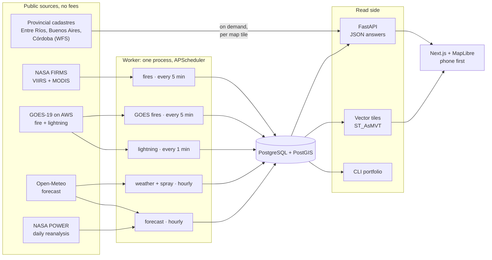

- **One read per region, not per field.** Every source is queried once for the Entre Ríos and Delta
  bounding box, and PostGIS matches the data to fields. Ten fields or ten thousand cost the same
  number of external calls.
- **Writes happen in the worker, the API only reads.** No model, download or heavy query sits in
  the request path; the API answers from stored results.
- **Thresholds in config.** Correlation radius, severity bands, spray rules, forecast bands and
  cadastre fitting live in [`config/thresholds.yaml`](config/thresholds.yaml).
- **Argentina only.** The map shows the whole world, but fires are kept and fields drawn only inside
  Argentina's boundary.

### How a satellite detection becomes a field alert

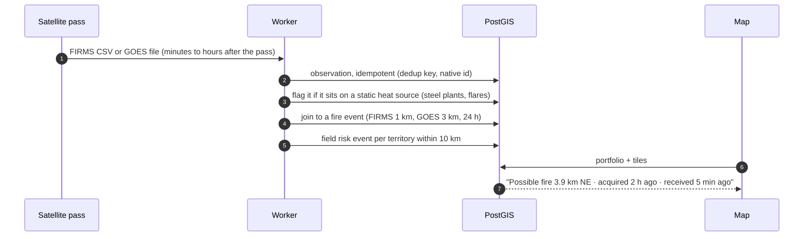

- **Observation, fire event and field risk event are separate.** Three satellites seeing the same
  fire are three observations and one fire event. One fire near fifteen fields is one fire event and
  fifteen field risk events.
- **Severity by distance:** inside the field `CRITICAL`, under 2 km `VERY_HIGH`, under 5 km `HIGH`,
  under 10 km `WATCH`.
- **Two timestamps.** `acquired_at` (the pass) and `ingested_at` (when we received it). FIRMS data
  for Argentina arrives hours after the pass, and the UI says so.
- **Data quality on every answer:** `GOOD`, `PARTIAL`, `STALE`, `CLOUD_OBSCURED`, `NO_DATA`. "No
  fires" is only said when the sources were read.

### Data model

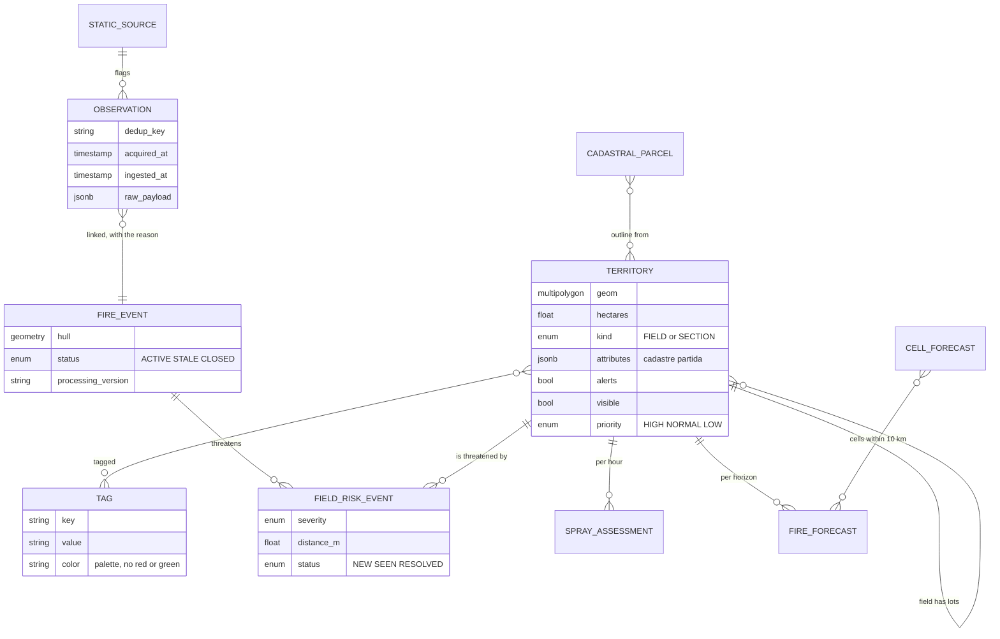

Every derived row stores a **processing version**: the package version plus a hash of
`config/thresholds.yaml`, so each past alert can be traced to the rules that produced it.

### Fire forecast

The probability of a satellite fire detection within 10 km of each field in the next 1, 2 and 3
days ([05-fire-forecast](docs/05-fire-forecast.md)).

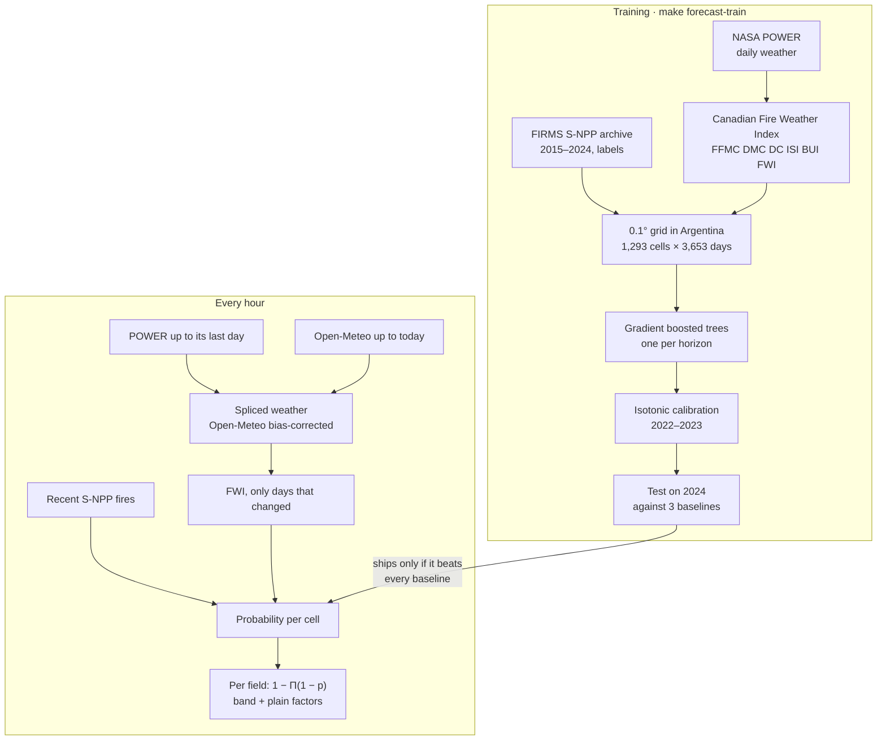

Test year 2024, next day. PR-AUC is the honest metric for rare events (the base rate is 0.9 %);
higher is better.

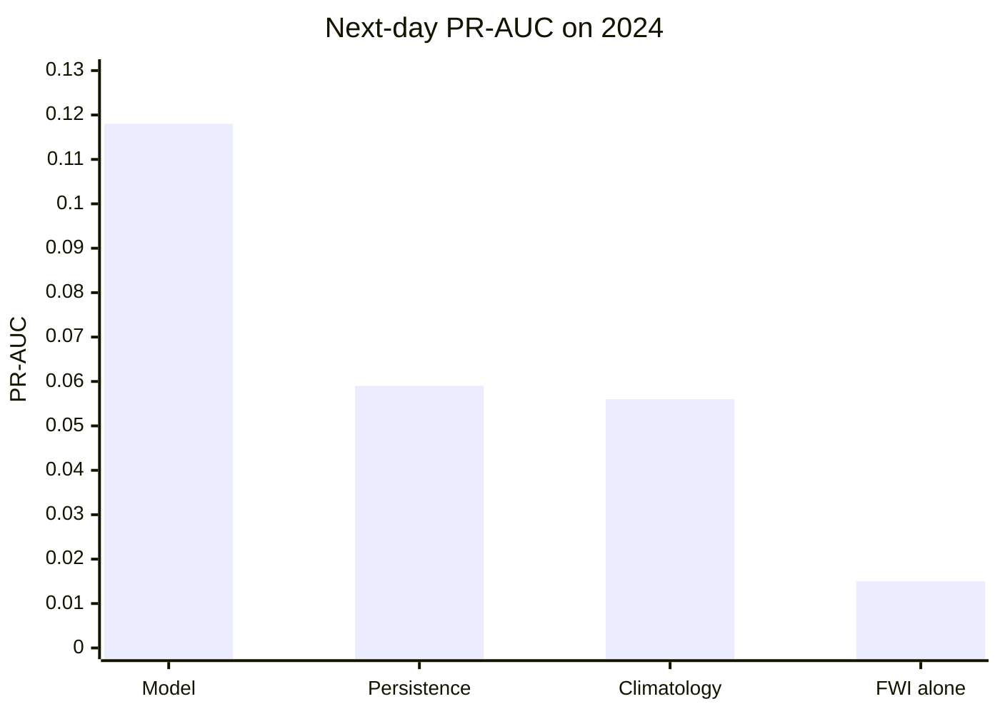

| Horizon | Model PR-AUC | Best baseline | Fires caught in the riskiest 5 % of cell-days |
|---|---|---|---|
| 1 day | 0.118 | 0.059 | 53 % |
| 2 days | 0.162 | 0.092 | 46 % |
| 3 days | 0.193 | 0.121 | 43 % |

The strongest signals are days since the last fire in the cell, fires around in the last week,
humidity and the cell's usual fire months. The full report is in
[docs/reports/fire-forecast.md](docs/reports/fire-forecast.md). In the app the forecast is a band
(`LOW` to `VERY_HIGH`) with the reasons in words ("dry for 18 days", "fires around this week").

### Drawing a field

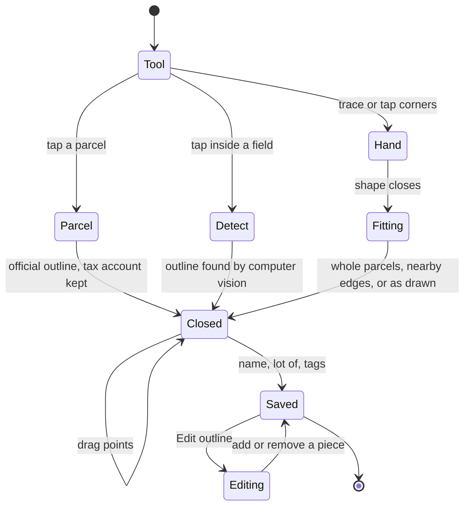

- Property lines come from the provincial cadastres of Entre Ríos, Buenos Aires and Córdoba,
  fetched per 5 × 5 km tile the first time an area is viewed and then served from PostGIS
  ([08-cadastre](docs/08-cadastre.md)). Elsewhere, or where a parcel is not the field, the
  Detect tool finds the outline in satellite images (next section).
- A rough outline around several parcels becomes their exact union; a lot inside a parcel has only
  its nearby corners and edges moved onto the lines. The original drawing is one tap away.
- The server checks every field: inside Argentina, a lot inside its field, a field around its lots.

Editing an outline asks the server first, so the card shows the result and any problem before
anything is saved:

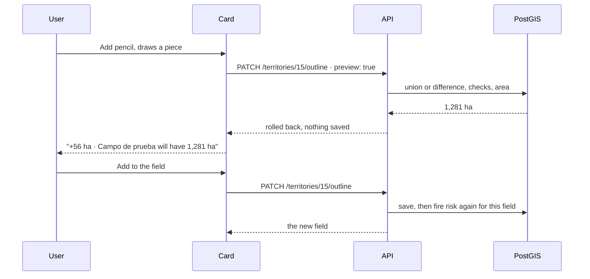

The checks refuse a piece that leaves the field empty, misses it, changes nothing, cuts a lot
out of its field, or leaves Argentina, each with a message in the user's language.

### Accounts

Anyone can watch fires on the map. Fields, tags and alerts belong to an account, opened with a
link by email: no passwords ([09-accounts-and-alerts](docs/09-accounts-and-alerts.md)).

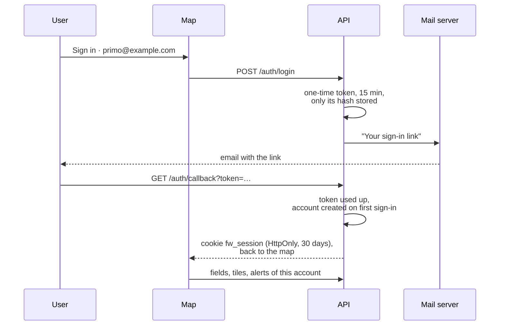

At most 5 links per address per hour, and the same answer for every address, so the form neither
floods an inbox nor reveals who uses the app.

### Per-field settings and alerts

Each field and lot can have alerts on or off, be shown or hidden, and have high, normal or low
priority ([01-product](docs/01-product.md#settings-per-field)). Alerts go by email and, while the
app is open, as browser notifications.

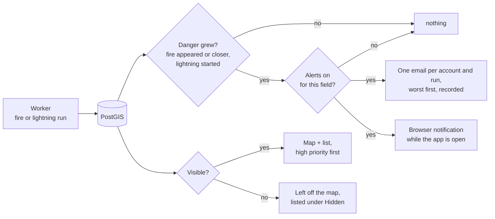

- Each email is marked as sent only after the mail server accepts it, so a failed send is retried
  on the next run instead of being lost.
- A fire near a field and its lots is one line, not one per lot; lightning is emailed at most
  once an hour per field.
- Danger already present is not announced again; only a change is news.

### Weather and summaries

Every field and lot, own or a client's, shows its weather in the list ("22° · wind from S 12 km/h ·
gusts 23 · 4 mm in 24 h") and, on its card, now plus the next 48 hours every 3 hours. It is the
same hourly forecast the spraying advice uses, so the two never disagree
([01-product](docs/01-product.md#weather-per-field)).

Alerts say what just changed; a **summary** says how every field is doing, by email, weekly on
Monday at 07:00 (the default), daily at 07:00 or never, chosen in the account menu, which can also
send one at once ([09-accounts-and-alerts](docs/09-accounts-and-alerts.md#summaries)).

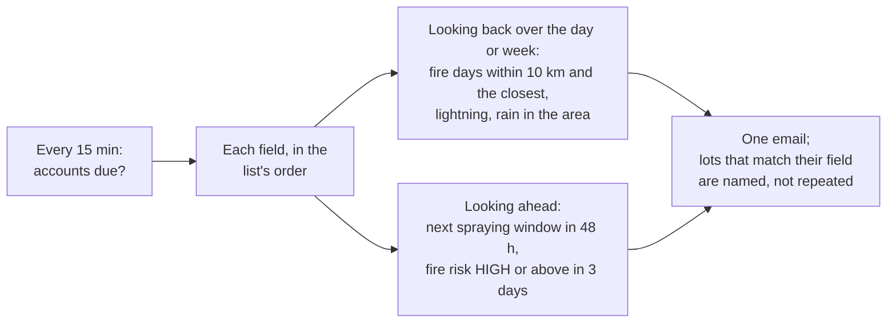

Fire days come from the satellite detections themselves, not from fire events, and detections on
known industrial heat sources do not count.

### Colored tags

Tags such as "casa", "cliente 1" or `crop:soy` each have a color from a palette with no red and no
green, so a client's field never looks like a fire. The layers menu switches the map between
coloring by status and by tag ([01-product](docs/01-product.md#tags-and-colors)).

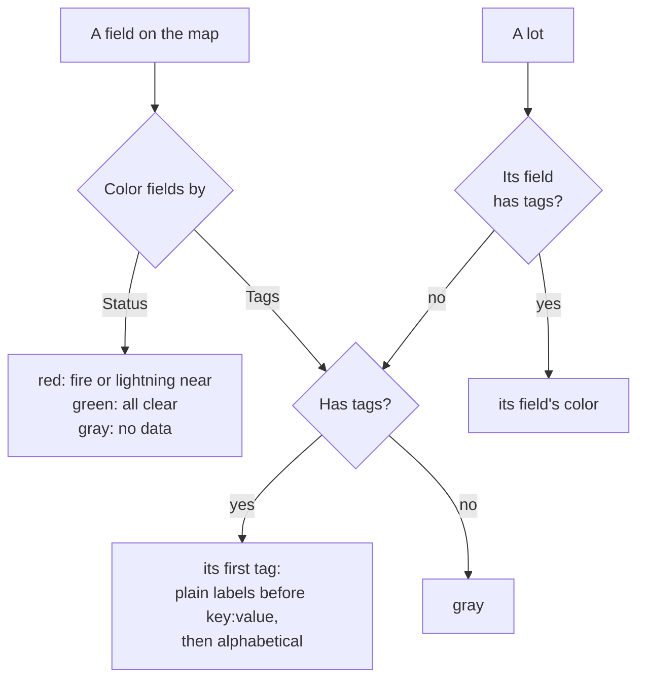

### Computer vision: field outlines from satellite images

Where there is no cadastre, or one parcel is farmed as two lots, the **Detect** tool finds the
field's outline with computer vision ([10-field-detection](docs/10-field-detection.md)). A field is
the land farmed the same way: over a year, every 10 m pixel of a field goes through the same crop
history (sown, green, ripe, harvested), and the field next door goes through another, even when
both look alike on one date. The method segments the image by that history.

```mermaid
flowchart LR
    T["Tap inside<br/>a field"] --> S["STAC search<br/>Sentinel-2 L2A,<br/>last 12 months"]
    S --> R["Read only a 4 × 4 km<br/>window per date<br/>(Cloud-Optimized GeoTIFF)"]
    R --> C["Drop cloudy dates<br/>(scene classification)"]
    C --> N["NDVI per date:<br/>a crop history<br/>per pixel"]
    N --> G["Region growing:<br/>pixels with the tap's<br/>history, connected"]
    G --> M["Morphology:<br/>opening, closing,<br/>holes filled"]
    M --> P["Polygon, simplified,<br/>squared when it is<br/>a rectangle"]
    P --> E["Editable outline<br/>on the map"]
```

- Classic computer vision: image segmentation by region growing on a multi-temporal NDVI stack,
  with mathematical morphology and boundary regularization. There is no model to train, and it
  runs on the API server's CPU.
- About 11 s the first time a place is read (12 dates, 4 in parallel), then cached for a week;
  finding the outline itself takes 0.03 s.

**How well it works.** Measured against the official cadastre with
`make field-detection-benchmark` ([report](docs/reports/field-detection.md)). Of 90 random rural
parcels, 50 hold more than one field (two crops, a pasture and a crop) and cannot be used as an
answer key; on the 40 that are one field, the score is the overlap (IoU) between the detected
outline and the parcel:

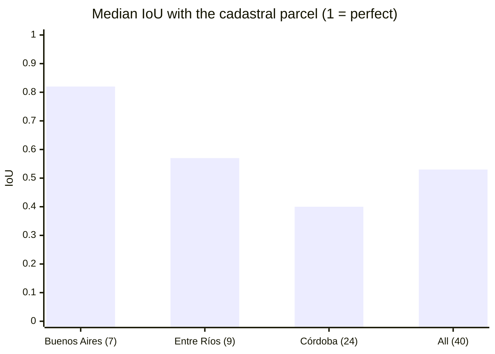

- 35 % of outlines overlap the parcel by 0.7 or more, enough to only check the corners; 5 % find no
  boundary and the app asks to draw by hand.
- It is an aid, not the truth: the card says the outline came from images and every point can be
  dragged. Fields with patchy weeds, or neighbours sown with the same crop on the same dates,
  are where it fails.
- Next step, measured with the same benchmark: a segmentation network trained on field
  boundaries.

### Computer vision: something unusual in the field

The third question, answered for every lot every time Sentinel-2 passes (about every five days):
is part of the field doing something the rest is not? A patch that dried out, standing water after
rain, a burnt corner ([11-field-anomalies](docs/11-field-anomalies.md)).

A field changes all year on purpose (sown, green, ripe, harvested), so comparing it with itself a
month ago would call every harvest a disaster. The method compares each 10 m pixel with **the rest
of its own lot on the same day**, and that difference with the pixel's usual one:

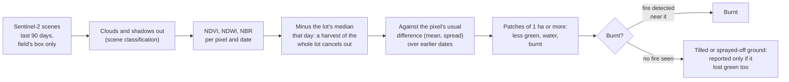

- **Per lot, not per field.** Lots are sown and harvested apart: in the first version, a 1,225 ha
  field of 16 lots showed 10 "patches" that were just one lot harvested before the others. Checked
  lot by lot, the same imagery shows none there.
- **Burns are confirmed with the fire detections the app already has.** Freshly tilled ground
  darkens the burn index the same way; seen on La Esperanza between 16 and 24 September, where
  the soil turned dark brown with no fire anywhere near. Without a satellite fire detection near
  the patch between the two dates, it is never called burnt.
- **Clouds are never "all fine".** With no clear pass in 10 days the card says since when the
  field is under cloud, and shows what the last clear image showed, with its date.
- Classic computer vision on index time series (no trained model), about 15 s per lot the first
  time and a single date per new scene afterwards, cached per lot.

### Map loading by zoom

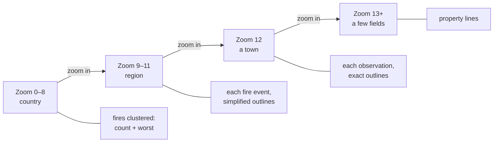

The map asks only for the vector tiles on screen, shows lower-zoom tiles while closer ones arrive,
and caches them, like Google Maps. Each field has a dark edge under its outline so it reads over
crops of any color on the satellite photo, and the selected one glows; motion (the glow fading in,
the card rising, the list cascading) is short and stops for anyone who asks their system for less
motion. Colors are red when something is wrong and green when all is
fine, everywhere. The decision log and the stack are in [02-architecture](docs/02-architecture.md).

## How it is built: spec first

| Spec | Covers |
|---|---|
| [00-conventions](docs/00-conventions.md) | Code and writing rules, commits |
| [01-product](docs/01-product.md) | User, the three questions, fields, lots, settings, colored tags, roadmap |
| [02-architecture](docs/02-architecture.md) | Pipeline, data model, processing version, stack, decisions |
| [03-rules](docs/03-rules.md) | FIRMS normalization, correlation, severity, spray rules, data quality |
| [04-frontend](docs/04-frontend.md) | Map-first UI, bottom sheet, vector tiles by zoom, explore mode |
| [05-fire-forecast](docs/05-fire-forecast.md) | Fire probability per field for 24–72 h: data, model, evaluation |
| [06-goes](docs/06-goes.md) | GOES-19 fire every 10 minutes, lightning, colors |
| [07-fire-history](docs/07-fire-history.md) | 10 years of fire near each field, from the FIRMS archive |
| [08-cadastre](docs/08-cadastre.md) | Official property lines (Entre Ríos, Buenos Aires, Córdoba), loaded on demand; drawings fitted to them |
| [10-field-detection](docs/10-field-detection.md) | Field outlines by computer vision from a year of Sentinel-2 images, and its benchmark |
| [11-field-anomalies](docs/11-field-anomalies.md) | Something unusual in a field: patches that change unlike the rest of their lot |
| [09-accounts-and-alerts](docs/09-accounts-and-alerts.md) | Sign-in by email link, fields per account, email alerts, SMTP |

CI runs on every push: ruff, the banned-words check, `alembic check` (migrations match the models),
the tests against a PostGIS service container, and a Docker image build.

## Data sources

| Purpose | Source | Terms | Status |
|---|---|---|---|
| Active fire detections | [NASA FIRMS](https://firms.modaps.eosdis.nasa.gov/) (VIIRS NOAA-20, NOAA-21, S-NPP; MODIS) | Free with a key; 5,000 requests per 10 min | Live |
| Fire every 10 minutes, lightning | GOES-19 ABI fire product and GLM, NOAA Open Data on AWS | Free, no key | Live |
| Ten years of fire per field, forecast labels | FIRMS yearly archive for Argentina | Free | Live |
| Weather and 48 h forecast | [Open-Meteo](https://open-meteo.com/) | Free API for **non-commercial use only** | Live |
| Daily weather history for the forecast | [NASA POWER](https://power.larc.nasa.gov/) (MERRA-2) | Free, no key | Live |
| Property lines | ATER Entre Ríos, ARBA Buenos Aires, IDECOR Córdoba (WFS) | Public; IDECOR is CC BY-SA 4.0 (credited on the map) | Live |
| Dark and light basemaps | CARTO Dark Matter and Positron | Free up to 1M requests a month for a business | Live |
| Satellite basemap | Esri World Imagery | Needs an ArcGIS license for commercial use | Live |
| Argentina's boundary | Natural Earth | Public domain | Live |
| Field outlines by computer vision | Sentinel-2 L2A from the Earth Search STAC catalog | Free (Copernicus) | Live |
| Unusual patches in a field, 10 m | Sentinel-2 L2A | Free (Copernicus) | Live |
| Field imagery, 30 m, thermal | Landsat 8/9 Collection 2 Level-2 | Free (USGS) | Planned |
| Radar through clouds, flooding | Sentinel-1 GRD | Free (Copernicus) | Planned |

## What it costs

Everything above is free for a personal or research project, and nothing in the repository needs a
paid account: email is caught locally by Mailpit, and CI runs on GitHub Actions, free for public
repositories. Using it for a business changes two things:

- **Open-Meteo:** the free API is non-commercial. A business needs one of its paid plans, or runs
  Open-Meteo itself (it is open source), or the weather source is replaced.
- **Esri World Imagery:** the satellite basemap needs an ArcGIS license for commercial use; the
  alternative is a satellite layer with an open license.

Running it for others also needs a server (database, API, worker) and an SMTP service for email;
neither is set up yet.

## Folders

| Folder | Contents |
|---|---|
| `docs/` | Specs |
| `config/` | `thresholds.yaml`: every rule parameter |
| `data/aoi/` | Sample fields, sections and tags near Larroque (GeoJSON) |
| `data/boundaries/` | Argentina's boundary from Natural Earth (public domain); fields must lie inside |
| `backend/app/providers/` | FIRMS, GOES, Open-Meteo and cadastre clients that return normalized records |
| `backend/app/services/` | Ingestion, correlation, field risk, spray, GOES, lightning, history, cadastre, portfolio |
| `backend/app/forecast/` | Fire Weather Index, training data, model training and live serving |
| `backend/app/vision/` | Computer vision: field outlines and unusual patches from Sentinel-2, and the outline benchmark |
| `backend/app/routers/` | FastAPI endpoints (HTTP only), including vector tiles |
| `backend/alembic/` | Database migrations |
| `backend/tests/` | Unit tests and PostGIS integration tests |
| `frontend/src/components/` | Map, bottom sheet, portfolio, field detail, forecast, drawing |
| `docs/reports/` | Forecast evaluation, regenerated with each retrain |
| `frontend/src/api/` | API client, TanStack Query hooks, generated types |
| `.github/workflows/` | CI |
