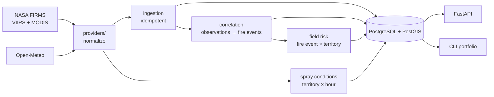

# Field Watch

Satellite monitoring for the fields of a crop-spraying contractor around Larroque, Entre Ríos
(Argentina). For every field and section it answers three questions: is there a fire nearby, are
spraying conditions favorable, and is something unusual happening in the field. Every answer shows
its sources, their timestamps and whether the field could actually be observed.

- **Status:** Phase 0 (technical spike). Fire and spray answers work from the CLI and the API.
  Field anomalies and the map UI come in Phase 1. See the [roadmap](docs/01-product.md#roadmap).
- Built by [Nicole Perrone](https://www.linkedin.com/in/perronenicole/).

## Run it locally

Requirements: Docker, Python 3.12 with [uv](https://docs.astral.sh/uv/), and make.

```bash
git clone https://github.com/nickyperrone/Fire-Detection-System.git
cd Fire-Detection-System
cp .env.example .env      # then set FIRMS_MAP_KEY
make setup                # installs dependencies, starts PostGIS, runs migrations
make seed                 # loads the sample fields, sections and tags near Larroque
make run-once             # reads FIRMS and Open-Meteo once and derives everything
make portfolio            # prints every field and section with its answers
```

- `FIRMS_MAP_KEY` is free: request it at https://firms.modaps.eosdis.nasa.gov/api/map_key/. Without
  it the fire answer shows `NO_DATA` and the spray answer still works (Open-Meteo needs no key).
- `make portfolio TAG=crop:soy` filters by tag.
- `make api` serves the API on http://localhost:8000 (docs at `/docs`). `make worker` runs the
  scheduled worker (FIRMS every 15 min, weather every 60 min).
- `docker compose up --build` runs the database, API and worker together.

Other commands: `make test` (unit and PostGIS integration tests), `make lint`, `make migration m="..."`.

## Example output

```
La Esperanza (312 ha)                     client:Juan Perez  zone:larroque-east
  Fire   HIGH      Possible fire 3.7 km NE · VIIRS NOAA-21, MODIS · high · acquired 2 h ago, received 5 min ago
  Spray  CAUTION   gusts 18 km/h (caution from 17) · next favorable window 18:00–21:00
  Weird  NO_DATA   imagery analysis starts in Phase 1
  Lote 1 — Soy (156 ha)                   crop:soy  to-spray-this-week
    Fire   HIGH    Possible fire 3.9 km NE
    Spray  CAUTION gusts 18 km/h (caution from 17)
```

## Architecture



- **One read per region, not per field.** FIRMS is queried once per sensor for the Larroque bounding
  box, and PostGIS matches detections to fields. The number of external calls does not grow with the
  number of fields.
- **Observation, fire event and field risk event are separate.** Three satellites seeing the same fire
  are three observations and one fire event. One fire near fifteen fields is one fire event and
  fifteen field risk events.
- **Idempotent ingestion.** A deterministic key per detection makes reprocessing harmless. The raw
  provider row is kept for traceability.
- **Two timestamps.** `acquired_at` (satellite pass) and `ingested_at` (when we received it). FIRMS
  data for Argentina arrives hours after the pass, and the UI says so.
- **Data quality on every answer:** `GOOD`, `PARTIAL`, `STALE`, `CLOUD_OBSCURED`, `NO_DATA`. "No
  detections" is only shown when the sources were read.
- **Processing version on every derived row.** It combines the package version and a hash of
  `config/thresholds.yaml`, so each historical alert can be traced to the rules that produced it.
- **Thresholds in config.** Correlation radius, severity bands and spray rules live in
  [`config/thresholds.yaml`](config/thresholds.yaml).

Full diagrams, the data model and the decision log are in [02-architecture](docs/02-architecture.md).

## How it is built: spec first

| Spec | Covers |
|---|---|
| [00-conventions](docs/00-conventions.md) | Code and writing rules, commits |
| [01-product](docs/01-product.md) | User, the three questions, fields, sections, tags, roadmap |
| [02-architecture](docs/02-architecture.md) | Pipeline, data model, processing version, stack, decisions |
| [03-rules](docs/03-rules.md) | FIRMS normalization, correlation, severity, spray rules, data quality |

## Data sources

| Purpose | Source | Phase |
|---|---|---|
| Active fire detections | [NASA FIRMS](https://firms.modaps.eosdis.nasa.gov/) (VIIRS NOAA-20, NOAA-21, S-NPP; MODIS) | 0 |
| Weather and 48 h forecast | [Open-Meteo](https://open-meteo.com/) | 0 |
| Field imagery, 10 m | Sentinel-2 L2A from the Earth Search STAC catalog | 1 |
| Field imagery, 30 m, thermal | Landsat 8/9 Collection 2 Level-2 | 1 |
| Radar through clouds, flooding | Sentinel-1 GRD | 3 |
| Fire and smoke every 10 min | GOES-19 ABI | 2 |

## Folders

| Folder | Contents |
|---|---|
| `docs/` | Specs |
| `config/` | `thresholds.yaml`: every rule parameter |
| `data/aoi/` | Sample fields, sections and tags near Larroque (GeoJSON) |
| `backend/app/providers/` | FIRMS and Open-Meteo clients that return normalized records |
| `backend/app/services/` | Ingestion, correlation, field risk, spray conditions, data quality, portfolio |
| `backend/app/routers/` | FastAPI endpoints |
| `backend/alembic/` | Database migrations |
| `backend/tests/` | Unit tests and PostGIS integration tests |
