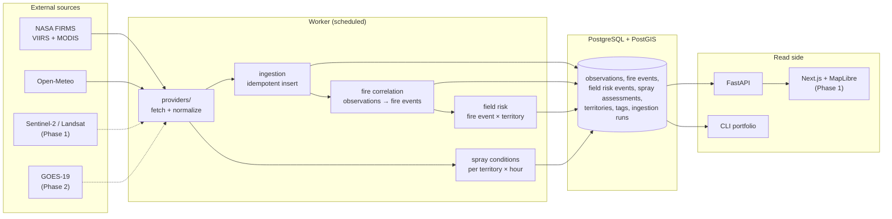
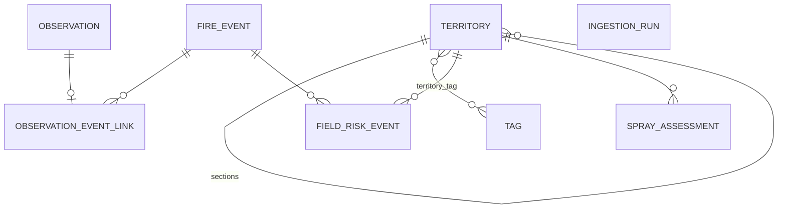

# 02 — Architecture

## Pipeline

- **Capture and normalize** happen in `providers/`. Each provider returns normalized records
  (`FireObservation`, `HourlyWeather`). Business code never sees provider column names or product codes.
- **One read per region, not per field.** FIRMS is queried once per sensor for the region bounding box
  (Larroque: `-59.30,-33.30,-58.70,-32.80`). Matching detections to fields is a PostGIS join, so
  10 or 10,000 fields cost the same number of external calls. Weather is read in one batched request
  for all field centroids, rounded to a 0.02° grid to share nearby points.
- **Store, then derive.** Raw observations are stored with their original payload. Fire events,
  field risk events and spray assessments are derived from stored rows and can be recomputed.
- **The worker is one process** with APScheduler in Phase 0. There is one kind of job and it takes
  seconds. A queue (Celery or SQS) is added when imagery processing needs parallel workers.

## Data model

| Table | One row per | Notes |
|---|---|---|
| `territory` | field or section | `kind` is `FIELD` or `SECTION`; sections have `parent_id`. Geometry is `MultiPolygon` (EPSG:4326), hectares computed on save |
| `tag`, `territory_tag` | tag; tag on a territory | `key` plus optional `value`, unique per owner |
| `observation` | satellite detection | `acquired_at`, `ingested_at`, `native_id` when the provider has one, `raw_payload`, `dedup_key` |
| `fire_event` | fire, independent of any field | hull of its observations, first and last detection, confirming sensors, status |
| `observation_event_link` | observation | the fire event it joined and the `reason` (distance, time gap, rule) |
| `field_risk_event` | fire event × territory | distance, bearing, severity, risk factors, status `NEW`/`SEEN`/`RESOLVED` |
| `spray_assessment` | territory × profile × hour | status, result of every rule, weather inputs, data quality |
| `ingestion_run` | provider call | product, started/finished, fetched and inserted counts, error |

### Observation ≠ fire event ≠ field risk event

- NOAA-20, NOAA-21 and MODIS can see the same fire within an hour. That is three observations and one
  fire event with three confirming sensors.
- A fire exists whether or not it is near a field. One fire 4 km from fifteen fields is one fire
  event and fifteen field risk events. Alerts are built from field risk events.

### Idempotency and traceability

- FIRMS has no detection id. `dedup_key` is the SHA-1 of product, satellite, acquisition time and
  coordinates rounded to 4 decimals (about 11 m). It is unique, and inserts use
  `ON CONFLICT DO NOTHING`, so reprocessing the same file adds nothing.
- Coordinates can shift slightly between reprocessed products. For providers with a native id,
  `(source, native_id)` is also unique and takes precedence.
- `raw_payload` keeps the original row, so any normalized field can be checked against the source.
- `ingested_at - acquired_at` is the provider latency. The UI uses both times.

### Processing version

Every derived row (`fire_event`, `observation_event_link`, `field_risk_event`, `spray_assessment`)
stores `processing_version`, for example `0.1.0+cfg.3f9a1c2e`: the package version plus the first 8
characters of the SHA-256 of `config/thresholds.yaml` in canonical JSON. Changing a threshold or
an algorithm changes the version, so every historical alert can be traced to the rules that produced it.

## Stack

| Layer | Choice | Reason |
|---|---|---|
| Database | PostgreSQL 16 + PostGIS 3.4 | Distance, intersection and buffer queries on `geography` in meters |
| Backend | Python 3.12, FastAPI, SQLAlchemy 2, GeoAlchemy2, Alembic | Same language as the raster and CV work in later phases |
| Worker | APScheduler in one process | One short periodic job; no queue needed yet |
| HTTP | httpx | Timeouts and a mock transport for tests |
| Rasters (Phase 1) | Cloud Optimized GeoTIFF read with rasterio from public STAC catalogs | Read only the field window; rasters never go into Postgres |
| CV (Phase 2) | Ultralytics YOLO | Smoke and fire on image tiles and drone photos |
| Frontend (Phase 1) | Next.js, TypeScript, Tailwind, MapLibre GL, mapbox-gl-draw | Open map stack, no dependency on Google Maps |
| Local run | Docker Compose | Database, API and worker with one command |

## Decisions

| Decision | Alternative rejected | Why |
|---|---|---|
| Use provider fire detections first | Train a fire model first | FIRMS already runs validated fire algorithms; the product layer is the missing part |
| Indices + change detection for field anomalies | YOLO as main anomaly detector | Crop stress, flooding and burn scars are spectral changes over time, not objects with edges. YOLO is kept for smoke and fire, which are localizable |
| Query per region | Query per field | External calls do not grow with the number of fields |
| `geography` for distance and area | Reproject to UTM 21S | Correct meters anywhere without choosing a zone |
| APScheduler worker | Celery + Redis | One job type in Phase 0; fewer moving parts |
| Correlation radius and window in config | Hard-coded rule | They are first heuristics (1 km, 24 h) and will be tuned with regional data |
| `FAVORABLE`/`CAUTION`/`UNFAVORABLE` | Yes/no | Conditions depend on product and equipment; the user sees which rule failed |
| No provider interface in Phase 0 | `SatelliteProvider` base class | One fire provider exists; the interface comes with GOES |
